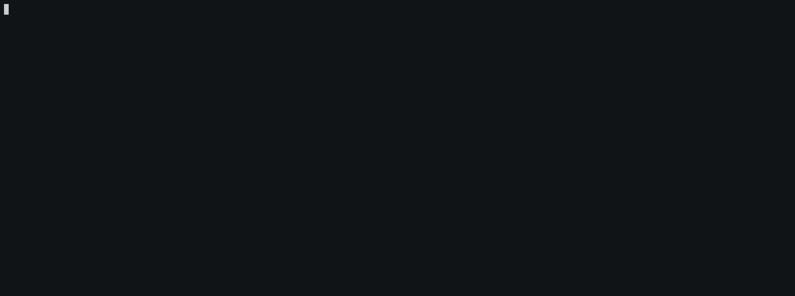

# CVE-2021-43798 – Grafana Exploit

## About

This is a proof-of-concept exploit for Grafana's Unauthorized Arbitrary File Read Vulnerability (CVE-2021-43798).

This vulnerability affects `Grafana 8.0.0-beta1 to 8.3.0`.

According to Shodan data, there are just over 2,000 Grafana servers exposed online, with the majority residing in the US and Europe, as can be seen in the figure below.

For more information:

https://grafana.com/blog/2021/12/07/grafana-8.3.1-8.2.7-8.1.8-and-8.0.7-released-with-high-severity-security-fix/
## Contributors

[@pedrohavay](https://twitter.com/pedrohavay) and @acassio22
# Disclaimer

This project is created only for **educational purposes** and cannot be used for law violation or personal gain.

The author of this project is not responsible for any possible harm caused by the materials of this project.

# Demo

# Installation

    git clone https://github.com/pedrohavay/exploit-grafana-CVE-2021-43798
    cd exploit-grafana-CVE-2021-43798
    pip install -r requirements.txt

# Usage

1. Collect all Grafana URLs in a single file. For example: `targets.txt`

2. Use the script

        python3 exploit.py

# Requirements

- Python 3
- SQLite3
